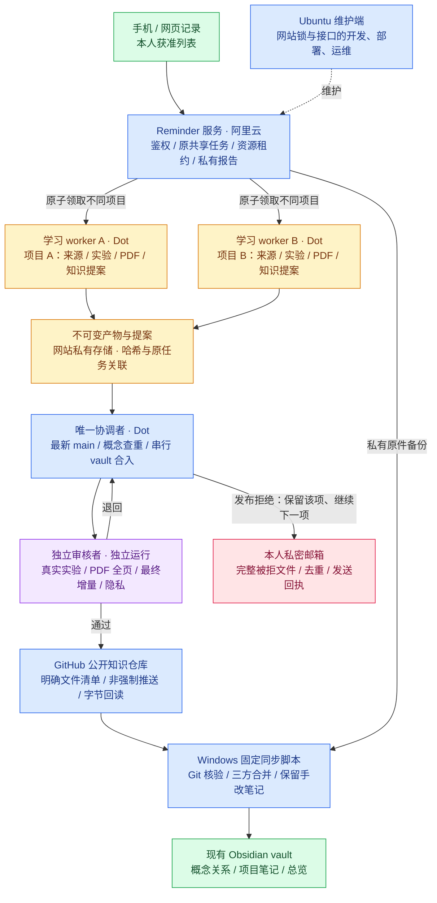

# 多智能体学习、Obsidian 合入与 Git 交付设计

设计日期：2026-10-06。状态：用户已要求展开设计；运行中的学习并发、领取机制和生产配置尚未改动。本文件中的新增字段、接口和参数均为拟实施契约，不是当前已上线能力。

## 1. 要达成的行为

不同项目可以同时阅读、实验、生成报告；同一记录、同一来源或同一项目的学习只能有一个有效执行者。每个学习 worker 交独立产物和知识提案，唯一 Dot 协调者将它们逐项合入最新 GitHub vault，再经真实独立审核发布。Windows 上线后核验、备份和同步现有 Obsidian vault。

发布受阻只影响该项：被拒文件完整内容私发本人邮件备份，保留 Git 待发布并继续其他独立项目。相同版本不重复发。邮件待确认或发送失败也不阻塞其他可执行步骤。任务勾选由用户本人操作。

第一版建议从两个学习 worker 开始，设置上限而不是直接开十个。两个学习者、一个独立审核者、一个协调者共四个角色；角色数不是 Dot 已支持四个独立运行的能力声明。Dot 能否启动真实独立 worker、隔离目录和限制工具，必须先实测。协调者和审核者不能由同一个执行过程换名兼任。

Ubuntu 仅维护阿里云上的领取、权限和状态接口；它不承担知识合并，也不是 Dot 直接提交 Git 的发布器。本设计不启用暂停的 PR #4 服务器发布器，不增加 delivery OAuth，不恢复 Windows 定时学习。

## 2. 已有能力与实际缺口

核对对象是 Windows 当前网站源码副本，不能将本地源码等同于实时生产版本。

| 部分 | 本地代码已有的保护 | 开放并行前需补的能力 |
|---|---|---|
| 网站领取 | taskId、owner、leaseId、来源版本校验；同链接冲突；过期归属不自动抢占 | 事务化跨请求资源锁、项目身份绑定、租约代次、有限并发与兼容迁移 |
| 网站完整学习 | 每个账户最多一个 full 领取 | 将账户级串行限制改为受控容量；不同项目允许并行，同项目仍互斥 |
| 网站链接判重 | `canonicalLink()` 处理纯 URL、X/Twitter 和部分跟踪参数 | 正文含文字或多个链接时提取全部来源；短链/镜像等价需证据，不凭搜索命中强绑 |
| Windows 队列 | SQLite `BEGIN IMMEDIATE`、URL 和本地项目路径锁 | 保留缓存和历史保护；跨设备学习以网站租约为准，不能把复制的 SQLite 当分布式锁 |
| 共享写入 | 本机 `reminder_coordinator.py` 保护本机 vault/Git；Dot 按唯一协调者规则运行 | 跨设备同一知识仓库的协调者身份与持有状态；worker 工具权限隔离 |
| 审核 | 六原件、PDF/实验/知识检查；审核名字与学习者名字不同 | 认证身份及实际独立运行证据，不能只比较名字或布尔值 |
| Windows 同步 | 实际 Git 字节与基线核验、三方文本合并、历史恢复、写前再次核对 | 和本机其他导入者统一锁；明确 Obsidian 人工保存的竞争边界 |

代码定位：`reminder-dot/repo/sync-server/dot-integration.js` 的 `canonicalLink`、`ownLease` 和 claim/save 分支；`tools/reminder_pipeline.py` 的 `_tx`、`_lock`、`_owned`；`tools/reminder_coordinator.py`；`tools/reminder_cloud_sync.py` 的 `apply_cloud_receipts`。

`完成/.pipeline/cloud-handoff-upgrade/state.json` 已保存默认主流程的一次真实端到端验收，但仍混有暂停的服务器发布器状态和较早的九项统计。后来的手动同步回执是十一项、零冲突。设计评估应引用各次确切证据，不能用单个旧标志宣布整批或并行已经完成。

## 3. 五条必须保持的约束

1. 账户和列表先鉴权，再判重。不能因另一账户存在相同链接而返回对方记录、报告或项目身份；公开 Git 成果另按获准读取范围关联。
2. 学习领取、资源绑定和容量检查必须是一个短事务；任何一个资源冲突，全组不领取，不留下半套锁。
3. 每个 worker 只写自己的任务、运行目录和提案；共享 vault、MOC、阶段账本和 Git 由唯一协调者维护。
4. 每次持久化验证当前来源、真实归属、租约有效性和锁代次；失效执行者可以保留本地草稿，不能交付为当前版本。
5. 学习报告、知识合入、Git 回读、邮件发送、本机同步分别记状态。重复请求可以重试，但外部效果按相同操作键复用结果；不声称跨网站、GitHub、邮箱存在一个原子事务。

## 4. 资源身份和原子领取

### 4.1 哪些资源要互斥

| 锁 | 建议作用域 | 何时持有 |
|---|---|---|
| 记录锁 | canonicalAccountId + taskId | 初步分类或该条学习运行 |
| 来源锁 | canonicalAccountId + 已核对来源身份 | 同一链接或相同文章的学习运行 |
| 项目锁 | canonicalAccountId + projectId | 完整学习与产物冻结；不同链接指向同一项目也冲突 |
| 共享知识与发布锁 | GitHub 仓库身份 + `vault`/main | 唯一协调者准备、审核、提交与回读 |
| 本机导入锁 | 实际 vault 绝对路径 | Windows 单次导入及其账本写入 |

记录和来源锁以账户为边界，不能仅用 listId：同一账户把一条任务或同一链接放到两个获准列表，仍须互斥。权限仍逐列表检查。共享知识锁以真实目标仓库为边界，不因来自不同列表而允许两个协调者同时修改同一总览。

锁只占短事务的数据库写入时间；租约持续数分钟至数小时，绝不在阅读网页、运行实验或等待审核时保持一个数据库事务。

### 4.2 相同项目如何识别

- 先提取记录正文中的全部 HTTP(S) 链接，再核实哪些是本条要学习的原始目标；按来源类型做可解释的规范化，移除已知跟踪参数，保留有业务意义的 query、路径和文章身份。未知参数不随意删除。来源锁针对学习目标及已确认的等价来源；实验依赖和共同参考文档只作证据，不能因两个项目都引用同一基础文档而把它们锁成一个任务。目标范围尚不明确时先核查，不启动完整学习。
- X/Twitter 文章身份、抖音作品身份、GitHub 仓库身份分别解析。短链跳转或镜像别名仅在实际读取、核对作者/原作品身份后登记。
- 正式项目身份由协调者登记在私有映射中：主来源、已核对别名、现有项目目录、项目范围。来源相同与项目相同是两种关系；同项目的不同版本可以是增补，不能直接等同重复。
- 项目尚不明确时只能完成受记录/来源锁保护的来源核查。正式完整学习前调用拟增加的 `bind-project` 操作，原子绑定项目锁；冲突则交核查证据给协调者并停止正式实验，避免两个 worker 已经各做一遍才发现重复。
- 确认的共同项目需同一注册身份，不能让两个执行者自由输入不同目录名绕过项目锁。迁移时沿用已有英文目录。

### 4.3 原子操作

拟扩展现有 `reminder_claim` / `reminder_renew` / `reminder_release`，不另建任务入口。新的私有运行字段包括 `runId`、`operationId`、`projectId`、`resourceEpochs` 和经过认证的 `principalId`；自由输入的 owner 只作显示与审计，不能代替身份。

领取事务：

1. 核对当前账户、允许列表、来源版本、历史保护和原任务阶段。
2. 计算全部资源键，按稳定顺序检查；有任何持有者即返回结构化冲突。
3. 检查该账户有效运行容量，创建租约，绑定全部资源键及单调递增代次。
4. 写领取事件、原任务阶段和操作结果后一次提交；网络响应丢失时同一操作键返回原结果。

冲突结果只返回本授权范围内必要的占用、原因和建议，不泄露其他账户。相同 operationId 携带不同请求摘要应报冲突，不覆盖原结果。

## 5. 租约到期、卡死与恢复

保留现有“不自动抢占过期 owner”的规则。建议沿用网站三十分钟租约，worker 约每五分钟续约；这是待配置参数，当前日程和租约未改变。

| 事件 | 操作 |
|---|---|
| 续约成功 | 原 run 继续，记录服务端到期时间 |
| 续约不可达、到期或归属失效 | 停止对网站/共享对象的交付，保存自身检查点；其他项目继续 |
| 租约过期 | 该记录/来源/项目保留归属；不计作活跃运行槽，其他独立项目可以使用空槽 |
| 原 owner 恢复并续约 | 同时校验来源、角色与容量；没有槽则等待，不能偷偷突破上限 |
| 人工确认旧执行者已停止 | 核实未知外部写入，归档旧尝试；明确释放并递增资源代次，再允许新 owner |
| 旧 worker 在释放后复活 | 提交携带旧代次，服务端拒绝；其草稿只留历史 |

递增代次是“这把锁第几次授权”的号码。只有最新持有者的号码可写，从而防止旧运行在新持有者接手后迟到交付。领取接口的身份和服务端时钟是依据，不用 worker 机器的本地时间决定有效性。

记录学习完成的不可变六原件与提案回读后，原 worker 明确释放自己的执行租约。等待知识合入或公开上传的账本继续保留，不需长时间占着学习容量。重复任务通过已交付的来源/项目版本关联已有成果，而不是依赖永久占锁。未确认写入结果则先恢复核查，不盲目释放。

### 5.1 状态存储

建议把网站同一 Dot 私有状态的租约、报告索引、项目映射及操作日志统一到事务存储，继续服务原接口、原任务、原授权；这是原状态的存储升级，不是第二个学习队列。初期保持单个网站实例，可采用同机 SQLite；不把数据库挂到 Windows 网络共享或给各设备各复制一份。

SQLite 只有一个并发写事务，`BEGIN IMMEDIATE` 可用于领取短事务；WAL 需要同机进程共享数据结构，不能当跨设备网络文件锁。[事务说明](https://sqlite.org/lang_transaction.html)、[WAL 说明](https://sqlite.org/wal.html)。数据库连接仍可能返回 busy，须有界退避，不能忽略异常后假报领取成功。

权限变更、网站记录修改与领取/保存的最后校验必须经过同一服务实例的短临界区，避免先读旧来源再异步写入。文件产物先落临时文件并核对字节，原子保存后登记索引；文件和索引跨介质的中断用持久操作日志恢复，不能把两者当一个数据库事务。以后增加服务实例前，再设计共享数据库和相同鉴权/来源版本事务；不能只增加容器副本。

迁移须停发新领取、备份私有状态及产物、逐条导入既有 owner/过期状态/来源指纹、核对数量和哈希、保持旧客户端兼容一个周期。新数据库必须纳入已有生产备份/恢复脚本；回滚用明确快照，不清空或重建账号。

## 6. Worker、审核者与协调者的交付契约

每个学习运行使用独立目录，例如 `work/<projectId>/<runId>/`。此示例不是现在新建的目录。上游代码、缓存和实验数据在所属隔离目录；不能让两个 worker 使用同一个浏览器标签页、HTML 输出或练习文件。已有项目的正式目录由协调者验收后归档。

worker 开始前只读实际 GitHub main 的总览、相关概念和已有项目，记录 commit 与笔记哈希；依照 learn-project 列疑问、联系已有知识、完成能力说明、真实实验和图文 PDF。初始知识快照保证讲解有基底，协调者最终合入时再读最新知识，解决其他项目在学习期间新增的概念和关联。第 8 步由 worker 交提案、协调者真正合入，第 9 步由协调者提交并回读；交提案不能被记成知识已入库。

拟交付的不可变 manifest 包含：原任务/来源版本的私有关联、项目身份、运行和资源代次、六原件的逐文件大小/SHA256、真实来源、实验版本/命令/输出、PDF 页面证据、知识提案摘要哈希和实际查重基线。公开副本不包含私有记录和运行标识。

知识提案提交结构化增量：候选概念名、定义、别名、适用领域、公开来源、拟关联的现有 conceptId/路径、原概念文件哈希、项目学习增量和链接建议。worker 不能直接写 vault、MOC 或 Git；协调者不接受任意外部路径、目录穿越、大小写碰撞或覆写他人目录的请求。

审核分两次：学习内容审核检查六原件和真实实验/PDF；协调者合入后审核确切的公开最终文件、概念关系、增量和隐私。新报告阶段与现有 full 标签兼容，但完整报告保存不能当作第 8/9 步已闭环，知识/Git 仍单列状态。

真实独立审核要求实际独立执行者和可检查的运行证据。拟增加的角色凭证只授予指定 proposal/plan 的读取和审核，绑定认证身份与实际运行；`reviewer != owner` 字符串检查不能证明独立。若 Dot 当前环境不能提供可核验独立运行和隔离工具，先保持单 worker 或转人工独立审核，不能靠新名字绕过。

审核指纹绑定最终文件字节、知识增量、基线、来源版本及原件集合；其中任何相关内容改变，旧审核不能直接用于新方案。纯内容未变化可以引用先前实验/PDF证据，但必须如实说明未重跑。

## 7. Obsidian 概念合入：并行提案，串行落库

### 7.1 合入步骤

协调者取得同一知识仓库的写入权后，从实际 main 读取总览、相关概念和项目笔记。提案中的旧基线只是线索，不按旧整文件覆盖当前笔记。

1. 精确匹配已有概念身份、标题、别名与相关领域，再阅读定义、适用边界、例子和来源。
2. 文本/语义检索只生成候选。含义相同才合并；相关但不同的概念用 `[[链接]]` 关联；同名不同义使用领域限定名称。不能把近义标题直接当重复。
3. 保留既有笔记和其他项目增量，追加或修订本项目公开、经证据支持的内容；每段增量以稳定的内容/来源身份去重。私有 taskId/reportId/owner 不进入公开去重标记。
4. 写项目笔记、概念及双向关联；总览按项目身份只增加/更新一条，不重复计数。
5. 给真实独立审核者检查全部最终文件、增量、知识链接及隐私，再按明确清单提交。

概念索引是可从已发布 vault 重建的辅助索引，不是第二个知识库。增量引入稳定 conceptId，不大批重命名已有笔记； aliases、领域和路径映射由协调者维护。同一个 conceptId 只有一个正式路径。

### 7.2 两个项目都出现同一概念的例子

A、B 各自提交“幂等性”的提案。A 先合入后，B 合入时重新读取已发布的该概念，保留 A 的定义与例子，只加入 B 的差异及来源；总览有 A、B 两个项目入口，概念笔记仍只有一篇。相同提案再到一次，直接回读原操作结果，不再追加相同段落。

若 A 的上传被拒，B 的合入不会把 A 尚未发布的候选冒充现有知识。协调者可以查看私有待合入提案作候选关联，须标明未入库；B 仍基于真实 main 建立自己的有效知识。之后恢复 A，再基于 B 已发布的最新版合并。

## 8. Git 发布与重试：保护主线并回读真实结果

Dot 继续使用自己的已授权 GitHub 连接；唯一协调者持有写能力，worker 只读或无 Git 工具。必须实测运行平台能隔离这些工具权限；如果只是提示词约定，明确标为组织规则，不能宣称实现了技术隔离。

每个发布操作有私有稳定 operationId，绑定来源、原件集合、知识提案和最终审核指纹。保存准备、候选提交、更新主线、逐字节回读的各步结果；回执和原任务关联留私有网站/本机。公开 publication manifest 仅列公开成果、实际 Git 基线与文件哈希，保持已有隐私约束。

写前读取真实 main：变化则重新查重合并并审核受影响的最终文件，建立新基线。提交仅含明确学习成果和相关 vault 清单，不全仓 add，不强推、不重置其他人工作区。

GitHub `force=false` 要求更新为快进，能保护已经进入分支的提交。[官方接口](https://docs.github.com/en/rest/git/refs#update-a-reference)。同基线的两个并发候选不能都直接覆盖 main；失败者须重读后重新合并。**它不识别 Reminder 的租约代次，不能当作跨系统任务锁。**

| 中断位置 | 恢复行为 |
|---|---|
| 部分 blob 已写，尚无 commit/ref | 保留对象证据与文件哈希；不记 Git 发布；复用已有字节对象 |
| commit 已创建、主线未更新 | 保存候选 commit；重新核对 main 和权限，不能自动强推 |
| 更新 ref 返回超时 | 先查实际 main、祖先关系和文件字节；成功则补回执，不再创建第二个成果提交 |
| main 已前移 | 检查候选是否已在实际历史中；若未发布，按新基线重新合并审核 |
| 回读不完整 | 保留已提交/待回读；其他独立学习可继续，不能写全部完成 |
| 审批拒绝 | 停止被拒动作，完整文件私发邮件备份、版本去重，保留待发布，继续下一项目 |

未知 ref 写入结果需要先恢复核查，再释放协调者本人的共享写入权。确定拒绝且没有未决 ref 请求时，保存该项账本并释放自己这次共享锁，不占着全局锁等待用户阅读邮件。恢复该项时重读基线。

### 8.1 默认直连路径的保证边界

网站可以强制拦截过期/旧代次的报告和阶段回写；GitHub 通用写接口无法校验 Reminder 代次。默认仍是一个可信、有效的 Dot 协调者，异常时不新建第二个 Git 写者。旧协调进程确已停止/写能力收回之前，不自动故障转移。即使 Git 成功，网站回执也须再核对来源和操作版本，不承认失效成果为当前任务完成。

若未来要求“过期协调进程即使仍持 Git 权限，也绝对无法更新 GitHub”，需要能在最终写操作验证代次的发布网关或等效受控写入口，这是额外方案和权限变更。本次不启用服务器发布器，也不将它设为并行学习的默认前置条件。不能把先检查租约再调用 Git 的两步描述成原子强制隔离。

## 9. Windows 与 Obsidian 人工编辑

Windows 继续 cloud-only：核验网站原件、实际 Git 字节和审核清单后，三方合并现有 vault。多个本机 agent 或备份触发器使用同一个本机导入锁；忙则返回“同步正在运行”，不启动第二个导入者，也不要求 Git reset。

取基线、生成候选、核对当前文件、写入临时文件、再次核对、原子替换、更新账本。多文件过程中断靠私有前像/操作日志恢复；已匹配目标字节的文件跳过，旧提交不回滚新版。

Obsidian 人工编辑不会自动遵守智能体锁。现有写前字节检查和三方合并已减少竞争，但最后一次检查与文件替换之间仍不能保证阻止所有人工保存。对正在编辑或持续变化的笔记，默认保留本机正文和候选合并结果，标待处理，其他文件继续；不能仅靠锁文件宣称人机编辑完全隔离。严格同时编辑需要 Obsidian 编辑端参与版本检查，或一次短暂停止编辑的明确合入窗口，作为后续可选增强。

冲突记录包含基线、本机、云端三个版本及候选位置，只有实际目标和账本一致才记本机知识已同步；不把云端发布成功当作本机已经合入。

## 10. 拟增加的契约与职责

以下名字是设计占位，不是可立即调用的已部署工具。

| 契约 | 职责 | 允许的执行者 |
|---|---|---|
| 扩展 `reminder_claim/renew/release` | 原子资源组、容量、身份、锁代次 | 按认证角色限定的学习运行 |
| `bind-project` | 核实来源与正式项目映射、原子绑定项目锁 | 协调者登记，worker 提交核查证据 |
| `submit-proposal` | 固定原件/提案指纹和操作回执，支持相同请求重试 | 该任务有效持有者 |
| `review-proposal/plan` | 认证审核身份、实际独立证据与精确指纹 | 独立审核运行 |
| 协调者领取/续约/释放 | 同一公开知识仓库只有一个有效协调写者 | Dot 唯一协调者 |
| `record-publication-stage` | 登记 Dot 直连 Git 的真实阶段和回读证据，不代 Dot 发 Git | 当前有效协调者 |
| 受阻附件/邮件账本 | 保存完整候选字节、版本去重、本人邮件回执 | 原协调者，使用既有本人邮件连接 |
| Windows 固定同步 | 原件备份、Git 核验、本机互斥和冲突保留 | 原本机协调者 |

旧 API 在并发开关关闭时保持现状；单 worker 模式仍校验原字段。含有新锁代次的模式不得默默接受缺字段的旧客户端作为新并行写者。所有角色严格限制本人允许列表，不传递 Windows/Ubuntu 密钥。

## 11. 实施顺序与验收

1. **能力与数据基线**：验证 Dot 真实独立 workers、工具隔离和审核证据；核对已部署服务版本及 private state 备份恢复；登记现有 owner，不改运行中任务。
2. **服务端保护，仍一条 full**：升级原存储及资源组/项目绑定/代次/操作回执。先保持最大 full=1，迁移和旧客户端兼容通过后再考虑放开。
3. **隔离产物与提案**：接通独立工作目录、不可变交付、审核角色证据和 coordinator 专有写权限；不允许 worker 写 vault/Git。
4. **串行知识与发布**：实现概念查重、确定性增量、确切方案审核、最新基线恢复和 Git 全字节回读；复用已验收直连发布模式。
5. **两项目试运行**：只选择两条新授权且非保护的独立项目，验证同时学习、串行合入、单项拒绝跳过和邮件去重；Windows 实际核验同步。
6. **稳定后扩容**：按审核/合入吞吐、队列等待和失败率决定从 2 到 4 等容量；不自动扩到十个。共享写入数始终 1。

这六步是实施路线，尚未执行。生产迁移/部署仍由维护端走既有审核和明确授权，不能以设计完成代替上线验收。

| 必须验证的场景 | 合格结果 |
|---|---|
| 20 个请求同时领取同一记录 | 只有一个有效租约，其余明确冲突，没有半套资源锁 |
| 带文字、跟踪参数、短链的同一原链接 | 核实等价后只执行一次；无法核实则保留待审 |
| 同账户两个列表、不同链接指同项目 | 权限各自核对，项目锁仍冲突，无跨列表重复学习 |
| 不同账户的相同链接 | 不泄露身份/报告；私有判重不跨账户返回信息 |
| 不同项目 | 不同学习 worker 能并行，vault/Git 写者最多一个 |
| 领取或保存响应丢失 | 相同操作键回读同一结果；不同请求摘要不得冒用原键 |
| 租约到期、明确释放后旧 worker 复活 | 不抢过期归属；新授权后旧代次写入被拒 |
| 所有槽占满、原 owner 过期恢复 | 容量不会突破，原 owner 等待而非冒称续约成功 |
| A/B 都提同一概念 | 仅一篇正式概念，保留两项目差异与来源，总览不重复 |
| 审核姓名伪造/协调者自审/方案换字节 | 拒绝；实际独立审核和最终指纹均可核查 |
| 两候选同 Git 基线、main 前移、推送超时 | 无强推、无丢失已有增量、无重复成果提交；真实回读后计成功 |
| 发布拒绝或邮件失败 | 该项保留待处理，其他独立项目继续；被拒文件完整、同版本不重复发 |
| Windows 导入中断、另一个导入者或用户编辑 | 恢复幂等、原笔记保留、冲突可追溯，不谎报本机同步成功 |
| 网站重启与恢复备份 | 租约/归属/项目映射/操作回执一致，OAuth 和原记录不丢失 |

验收须包括真实竞争请求、故障注入和两项目端到端试运行，不能只断言函数返回或更换 owner 名字。旧 owner、私密原件、用户手改笔记和任务勾选不得因试运行被覆盖。

## 12. 本轮结论和下一步

已完成架构设计和代码边界核对；未修改锁实现、领取状态、worker 数或生产日程。之前的暂缓事项现在进入设计阶段，实施和扩容仍待上述能力/保护验收。

先落实第 1/2 步，保持现有 single-full 模式验证所有保护，再启用两个项目并行。学习并行带来的速度增益来自同时阅读/实验；知识库保持单一写入口，使后续每个项目都基于真实、最新、已关联的 vault。
