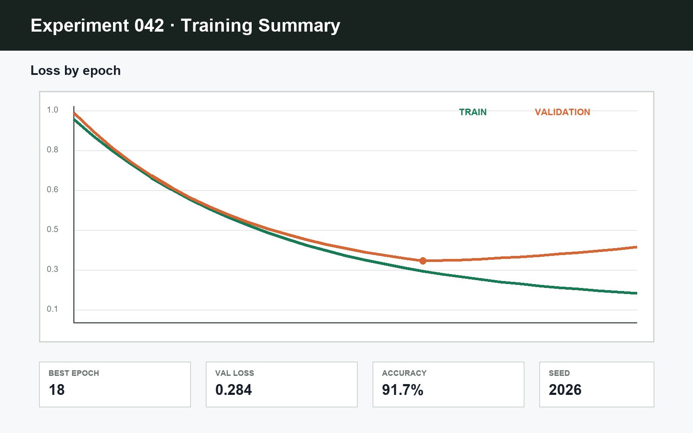

# ECO 项目讨论群

Conversation ID: `eco-project`

## 2026-08-21

**张三** · 09:12

昨晚的 workflow 已经跑完。先看收敛曲线，再决定是否调整第二阶段的学习率。

**李四** · 09:16

我整理了结果。验证集在第 18 个 epoch 后没有继续改善，但训练集仍在下降，可能出现了过拟合。

**李四** · 09:17

**张三** · 09:22

图里有两个信息需要复核：一是 validation loss 的平滑窗口，二是异常点是否来自数据加载失败。请把原始日志也保留下来。

**系统** · 10:00

_项目里程碑已更新为：复核实验结果_

## 2026-08-22

**李四** · 14:08

已经排除了数据加载失败。新的实验固定了随机种子，并把早停 patience 从 5 调到 8。结果会和上一轮使用完全相同的数据切分。

**李四** · 14:10

File attachment: `../repo/examples/experiment_run_042.log`

**张三** · 14:21

可以。最终报告里同时放最佳指标和训练成本，不要只比较 accuracy。
